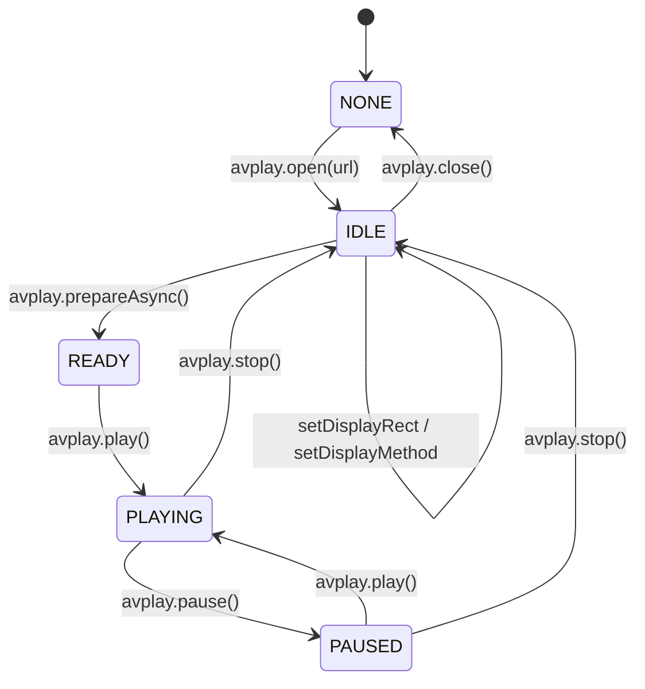

# Samsung Tizen AVPlay Player & Stream Integration

This document describes the architecture, lifecycle, and best practices for Harbor's native Samsung AVPlay (`webapis.avplay`) integration on Tizen Smart TVs.

---

## 1. Overview & Purpose

On Samsung Smart TVs (Tizen 3.0+ through 9.0+), the webview's native HTML5 `<video>` tag has critical limitations:

- Limited hardware video decoding coverage (HEVC/H.265, HDR10, AV1).
- Suboptimal memory handling and container demuxing performance for high-bitrate 4K debrid/torrent streams.
- Lack of native hardware plane surface rendering.

Samsung provides the native **AVPlay API** (`window.webapis.avplay`), backed by hardware-accelerated GStreamer pipelines. Harbor's `tizen-avplay.ts` implements Harbor's unified `IPlayer` and `PlayerBridge` abstractions over AVPlay, enabling smooth, hardware-accelerated 4K HDR playback and native TV controls.

---

## 2. Architecture & Hardware Plane Geometry

### Hardware Surface Plane vs Webview

AVPlay does not render inside the DOM like an HTML5 `<video>` element. Instead:

1. It renders directly onto a dedicated native hardware video plane beneath the web application.
2. An `<object type="application/avplayer">` placeholder is inserted into the player stage DOM.
3. The player container and stage background must have transparent backgrounds (`background-color: transparent`) to ensure the underlying hardware plane is visible without visual occlusion.

### Coordinate & Geometry Scaling

On Tizen, the webview viewport often reports scaled CSS pixels (such as `1140x642` or `1280x720` under UI zoom), while AVPlay requires **physical TV panel coordinates** (e.g., `1920x1080` or `3840x2160`).

Harbor's geometry coordinator calculates:

```ts
const sw = window.screen.width || 1920;
const sh = window.screen.height || 1080;

// Fullscreen stage maps directly to full hardware panel dimensions
player.setDisplayRect(0, 0, sw, sh);
player.setDisplayMethod("PLAYER_DISPLAY_MODE_AUTO_ASPECT_RATIO");
```

---

## 3. Stream URL Resolution & Chained Redirects

### The Chained Redirect Challenge

Stremio debrid and proxy streams (such as Torrentio, TorBox, RealDebrid, AllDebrid) frequently issue temporary HTTP redirects:

1. Initial addon resolve endpoint (`302 Found`).
2. Debrid API token exchange (`307 Temporary Redirect`).
3. Final CDN media server URL.

Samsung's native multimedia backend (`souphttpsrc` inside AVPlay) can abruptly terminate or crash when encountering cross-domain HTTPS redirect chains during `avplay.open()`.

### Upfront Resolution

Harbor performs lightweight asynchronous HTTP redirect resolution prior to handing the stream to AVPlay:

```ts
let playUrl = src.url;
if (/^https?:/i.test(playUrl)) {
  try {
    const headRes = await fetch(playUrl, { method: "HEAD", redirect: "follow" });
    if (headRes.url && headRes.url !== playUrl) {
      playUrl = headRes.url;
    }
  } catch (e) {
    console.warn("[tizen-avplay] HEAD redirect resolve failed, falling back to original URL:", e);
  }
}

await player.initialize(playUrl, ...);
```

This guarantees that AVPlay is opened directly against the final target media container, preventing backend crashes.

---

## 4. AVPlay Lifecycle & State Machine

Samsung AVPlay operates under a strict synchronous state machine:
`NONE` ➔ `IDLE` ➔ `READY` ➔ `PLAYING` / `PAUSED`.



### Critical Rules:

1. **Property Configuration**: `SET_MODE_4K`, `ADAPTIVE_INFO`, and `setDisplayRect` **must** be called while in `IDLE` state before calling `prepareAsync()`.
2. **4K Mode Support**: Requires the `http://developer.samsung.com/privilege/productinfo` privilege in `src-tizen/config.xml`. Harbor checks `window.webapis.productinfo.isUdPanelSupported()` and activates 4K streaming properties.
3. **Startup Duration & Initial Seeks**: AVPlay frequently reports `durationSec === 0` until container headers are fully demuxed during playback. Startup resume seeks are synchronized safely without waiting on duration validation to prevent startup deadlocks.

---

## 5. UI & Engine Selection

- **Tizen Platform Isolation**: On Samsung Smart TVs, Harbor detects Tizen via `isTizen()` and replaces desktop `mpv` with `AVPlay (Tizen)`.
- **Auto Engine Selection**: In `Auto` mode on Tizen, `AVPlay` is the default engine for all non-live video streams.
- **Diagnostics & Stats Overlay**: An on-screen HUD (toggled via remote keys or debug mode) displays AVPlay state, buffer metrics, resolution, and demuxer status without interfering with video presentation.
